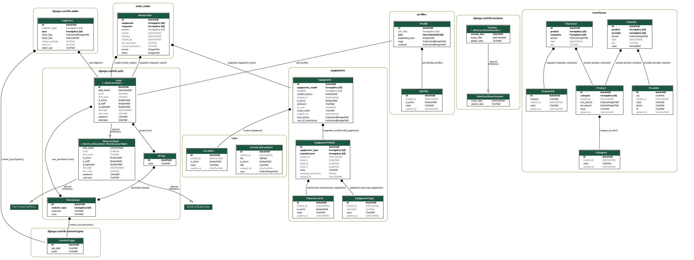

<h1 align="center">
    
</h1>

<h4 align="center">
    SIGEMH
</h4>

## 🚀 Tecnologias
Esse projeto foi desenvolvido com as seguintes tecnologias:

- [Python](https://www.python.org/)
- [Conda](https://conda.io/projects/conda/en/stable/user-guide/install/download.html)
- [Django](https://www.djangoproject.com/)

## 💻 Projeto
**Sistema de gestão de Engenharia Clínica para cadastro de equipamentos e ordem de serviço.**
<div align="center">
    
</div>
<p align="center">Models</p>
<hr>


### Run
```sh
# clonar repositório
git clone https://github.com/andre23arruda/sigemh

# Entrar na pasta
cd sigemh

# Instalação
make install

# Executar as migrações
make migrate

# Start
make run
```
